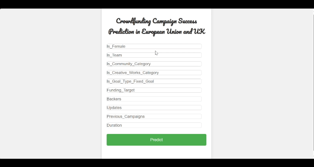

# Crowdfunding_In_Europe_Indiegogo

The notebook is related to my master's thesis to study the main factors that can impact the probability of a successful crowdfunding campaign in Europe based on the Indiegogo platform.

## Objectives
This study aims to use the data scrapped from the Indiegogo website for crowdfunding in the European region in the period from 2010 to 2023 in order to:
- Investigate the impact of project characteristics, fundraiser characteristics, and pledging
conditions on the probabilities of having a successful crowdfunding campaign.
- Figure out the importance of the selected features in defining the campaigns’ success.
- Determine the most suitable machine learning algorithms to predict the success or failure of the campaigns advertised on Indiegogo and based in Europe.

## Deployment
The champion model chosen was Logistic Regression, which is used to build a model using Flask to predict the campaign success based on certain criteria as shown below.

## Visualization
The dataset of this project is utilized to build multiple dashboards Using Microsoft Power BI.

